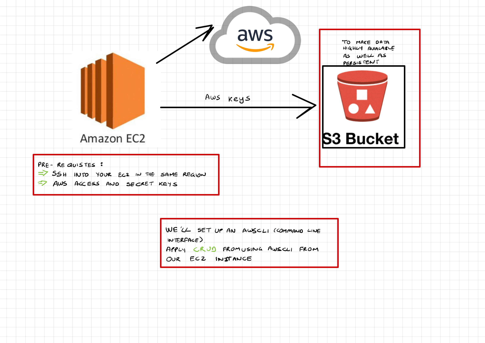

# S3
Amazon S3 or Amazon Simple Storage Service is a service offered by Amazon Web Services that provides object storage through a web service interface. S3 is the only object storage service that allows you to block public access to all of your objects at the bucket.



# Disaster Recovery Scenario

In teh case of a disaster emergency we must have our files backed up. This is where **S3 Buckets** come in ...

# AWS Comnand Line Interface (AWSCLI)

Install dependencies:
```
sudo apt-get install python3.7 
sudo apt-get install python3-pip -y 
alias python=python3
sudo pip3 install awscli
aws configure
```

- Insert access key 
- Insert secret access key 
- Insert Region : eu-west-1
- Insert : json

`aws s3 ls`

# Create a bucket

make a bucket:
`aws s3 mb s3://eng89brittany --region eu-west-1`

Note: It does not accetpt any special characters

Copy file to bucket:
`aws s3 cp test.text s3://eng89brittany/`

Copy file from bucket:
`aws s3 cp s3://eng89brittany/test.text test.text`

Delete file from bucket:
`aws s3 rm s3://eng89brittany/test.text`

Delete bucket:
`aws s3 rb s3://eng89brittany`

# Activity

***Exercise:***
- **Launch new EC2 ubuntu instance :**
- **Next:** 
- **Research the documentation on AWS/Python for python  ```boto3``` package to create and manage AWS S3 resources and complete all the following tasks**

***DOD:***
- Setting up awscli and python Env with required dependencies
-   S3 authentication setup - with aws configure on EC2
-  Create S3 bucket using python-boto3
-  Upload data/file to S3 bucket using python-boto3 
-  Retrieve content/file from S3 using python-boto3
-  Delete Content from S3 using python-boto3
-  Delete the bucket using python-boto3.**

```
# Import key variables
from secret import access_key_id, secret_access_key_id
# Install packages
import boto3

# Creating a S3 client
client = boto3.resource('s3',
                        aws_access_key_id=access_key_id,
                        aws_secret_access_key=secret_access_key_id,
                        region_name='eu-west-1')
s3_client = boto3.client('s3',
                         aws_access_key_id=access_key_id,
                         aws_secret_access_key=secret_access_key_id,
                         region_name='eu-west-1')

# Creating a bucket in AWS S3
client.create_bucket(Bucket='eng89brittany',
                     CreateBucketConfiguration={'LocationConstraint': 'eu-west-1'})

# Upload a file to the bucket
s3_client.upload_file('hello.txt', 'eng89brittany', 'hello.txt')

# Retreive file for S3


# Delete file form S3
s3_client.delete_object(
    Bucket='eng89brittany',
    Key='hello.txt'
)


# Delete Bucket
s3_client.delete_bucket(
    Bucket='eng89brittany',)
```